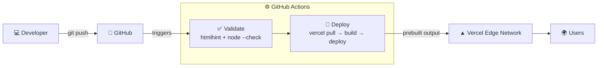

# 🦖 Dino Run

A browser endless runner inspired by Chrome's offline dinosaur game. It's plain HTML, CSS and JavaScript with no build step and no dependencies. It deploys to Vercel through a GitHub Actions CI/CD pipeline.

**Live:** https://dino-run-phi.vercel.app

- Jump over cacti and duck under birds
- The game speeds up the longer you survive
- Your high score is saved in the browser
- Retro sound effects
- Supports dark mode, keyboard and touch
- The footer shows the exact commit and pipeline run behind the live page

## Contents

- [Controls](#controls)
- [Project structure](#project-structure)
- [Run locally](#run-locally)
- [Customize](#customize)
- [How the pipeline works](#how-the-pipeline-works)
- [End-to-end flow](#end-to-end-flow)
- [Debugging guide](#debugging-guide)

## Controls

| Action | Keys |
|---|---|
| Jump / start / restart | <kbd>Space</kbd>, <kbd>↑</kbd>, <kbd>W</kbd>, or tap |
| Duck (fast-fall in mid-air) | <kbd>↓</kbd>, <kbd>S</kbd> |

## Project structure

```
.
├── .github/workflows/deploy.yml   # CI/CD pipeline
├── public/                        # everything Vercel serves
│   ├── index.html
│   ├── style.css                  # theme tokens (colors)
│   └── game.js                    # game logic; tune gameplay in CONFIG
├── vercel.json                    # static hosting config
└── README.md
```

## Run locally

```bash
npx serve public
# or
python3 -m http.server 8000 -d public
```

When running locally, the footer says **"Running locally"**. Build info is only filled in by the pipeline.

## Customize

### Your first change: put your name on the screen

The game shows a GitHub username in the top-left corner. Changing it is the quickest way to watch the pipeline deliver a change:

1. In `public/game.js`, set `githubUsername` to your own username:
   ```js
   githubUsername: 'your-username',
   ```
2. Commit and push:
   ```bash
   git commit -am "Show my GitHub username"
   git push
   ```
3. Watch the run in the **Actions** tab (or run `gh run watch`), then refresh the live site. Your `@username` appears on the game screen, and the footer shows your new commit.

### Gameplay

Edit `CONFIG` at the top of `public/game.js` to change the gameplay:

```js
const CONFIG = {
  githubUsername: 'thivindu',
  startSpeed: 6,
  maxSpeed: 13,
  acceleration: 0.0015,
  gravity: 0.65,
  jumpVelocity: 12,
  birdsAfterScore: 250,
  ...
};
```

Colors live as CSS variables in `public/style.css`. The game reads `--ink`, `--game-bg` and `--cloud` directly.

---

## How the pipeline works



| Trigger | Result |
|---|---|
| Push to `main` | validate → **production** deploy |
| Pull request to `main` | validate → **preview** deploy (unique URL) |
| Manual (`workflow_dispatch`) | validate → production deploy |

The workflow in `.github/workflows/deploy.yml` has two jobs.

**1. `✅ Validate`**

| Step | What it does | Fails when |
|---|---|---|
| Lint HTML | `npx htmlhint "public/**/*.html"` | Unclosed tags, duplicate IDs, unescaped `&`, and similar |
| Check JavaScript syntax | `node --check public/game.js` | Any syntax error in `game.js` |

**2. `🚀 Deploy`** runs only if Validate passes.

| Step | What it does |
|---|---|
| Install Vercel CLI | `npm install --global vercel@latest` |
| Stamp build info | Replaces `__COMMIT_SHA__`, `__BUILD_TIME__`, `__REPO__`, `__RUN_URL__` in `index.html` |
| Pull Vercel project settings | `vercel pull`: authenticates with `VERCEL_TOKEN` and finds the project via `VERCEL_ORG_ID` + `VERCEL_PROJECT_ID` |
| Build | `vercel build`: copies `public/` into `.vercel/output` on the runner |
| Deploy to Vercel | `vercel deploy --prebuilt`: uploads the output (with `--prod` on `main`) |
| Summary | Writes the environment, commit and URL to the run summary |

Two more settings are involved:

- **`concurrency`:** a new push cancels any in-progress run on the same branch, so only the newest commit deploys.
- **`vercel.json` → `git.deploymentEnabled: false`:** Vercel's own Git integration never deploys. GitHub Actions is the single path to production, so you never get duplicate deployments, and the validation step can't be bypassed.

---

## End-to-end flow

Follow this once to go from an empty machine to a live site. After that, every change is just [step 6](#6-make-a-change-and-ship-it).

### Prerequisites

| Tool | Check | Install |
|---|---|---|
| Git | `git --version` | https://git-scm.com |
| Node.js 18+ | `node --version` | https://nodejs.org |
| GitHub CLI (optional, used below) | `gh --version` | https://cli.github.com, then `gh auth login` |
| Vercel CLI | `vercel --version` | `npm install --global vercel` |

You also need a GitHub account and a Vercel account. The free Hobby plan is fine.

### 1. Get the code and run it locally

```bash
git clone https://github.com/<you>/dino-run.git
cd dino-run
npx serve public          # open the printed URL and play
```

### 2. Link a Vercel project

```bash
vercel login
vercel link               # "Link to existing project?" → No → name it dino-run
cat .vercel/project.json
```

```json
{ "projectId": "prj_…", "orgId": "team_…", "projectName": "dino-run" }
```

`vercel link` creates `.vercel/` and sometimes `.env.local`. Both are git-ignored and must **never** be committed.

### 3. Create a Vercel access token

1. Go to https://vercel.com/account/tokens and click **Create Token**.
2. **Scope:** choose the same account or team that owns the project (the `orgId` above). A token scoped to a different account authenticates fine but **can't see the project**, which is the most common setup failure.
3. **Expiration:** choose whatever suits you. When it expires, the pipeline fails until you replace it.
4. Copy the token. Vercel only shows it once.

### 4. Add the three GitHub secrets

Setting them with the CLI avoids copy-paste mistakes like stray quotes, spaces or swapped values:

```bash
gh secret set VERCEL_ORG_ID     --body "$(node -p "require('./.vercel/project.json').orgId")"
gh secret set VERCEL_PROJECT_ID --body "$(node -p "require('./.vercel/project.json').projectId")"
gh secret set VERCEL_TOKEN      # prompts you to paste the token (keeps it out of shell history)
gh secret list                  # should list all three
```

<details>
<summary>Or use the GitHub website</summary>

Go to **Repo → Settings → Secrets and variables → Actions → New repository secret** and add:

| Name | Value |
|---|---|
| `VERCEL_TOKEN` | the token from step 3 |
| `VERCEL_ORG_ID` | `orgId`, without quotes |
| `VERCEL_PROJECT_ID` | `projectId`, without quotes |

</details>

### 5. Trigger the first deploy

```bash
gh workflow run deploy.yml                    # or push any commit to main
gh run watch                                  # live progress in the terminal
```

When it finishes, the production URL appears in the run's **Summary** and in the repo's **Deployments** panel on the right-hand side.

### 6. Make a change and ship it

```bash
# edit something, e.g. the <h1> in public/index.html
npx htmlhint "public/**/*.html" && node --check public/game.js   # same checks as CI
git add -A
git commit -m "Change the heading"
git push
gh run watch
```

### 7. Verify the live site is running your commit

```bash
git rev-parse HEAD
curl -s https://dino-run-phi.vercel.app | grep -o 'data-commit="[^"]*"'
```

The two SHAs should match. You can also check the footer on the live page, which links to the commit and to the pipeline run that deployed it.

### 8. Preview a change before it reaches production

```bash
git checkout -b feature/new-title
# edit…
git commit -am "Try a new title"
git push -u origin feature/new-title
gh pr create --fill
```

The PR run deploys to a **preview** URL, which is shown in the run summary and on the PR. Production is untouched until you merge.

### 9. Roll back a bad release

| Option | Command | Notes |
|---|---|---|
| **Revert the commit** (preferred) | `git revert HEAD && git push` | Goes through the pipeline, and history shows what happened |
| **Instant rollback** | `vercel rollback` | Points production at the previous deployment in seconds. The next push to `main` deploys normally again. |
| **Promote a specific deployment** | `vercel ls`, then `vercel promote <deployment-url>` | Useful when the good version is further back |

---

## Debugging guide

### Step 1: Work out where it failed

```bash
gh run list --limit 5                   # find the run
gh run view <run-id>                    # see which job and step failed
gh run view <run-id> --log-failed       # only the logs from the failing step
```

> ⚠️ **Check the attempt number.** A re-run keeps the same URL, and the page shows the attempt you have selected. Make sure you're reading the **latest attempt** and its timestamp. It's easy to look at an old failure after the problem has already been fixed.

Then find the failing step in the table below.

### Step 2: Look up the error

#### Git / push

| Symptom | Cause | Fix |
|---|---|---|
| `! [rejected] main -> main (fetch first)` or `non-fast-forward` | The remote has commits your local branch doesn't. This often happens after running `git init` again in a moved or copied folder. | `git fetch origin && git reset origin/main`, then commit and push. This keeps your files. |
| `refusing to merge unrelated histories` | Same cause as above | Same fix. Or, **only for a solo repo**, `git push --force` to replace the remote history. |
| No workflow run appears after a push | You pushed to a branch other than `main` and didn't open a PR, or Actions is disabled | Push to `main` or open a PR. Check **Settings → Actions → General**. |

#### ✅ Validate job

| Symptom | Cause | Fix |
|---|---|---|
| `htmlhint` reports `tag-pair`, `id-unique`, `spec-char-escape`, … | Invalid HTML | Run `npx htmlhint "public/**/*.html"` locally and fix the reported line |
| `node --check` prints `SyntaxError` | Broken JavaScript, such as a missing `}` or `)` | Run `node --check public/game.js` locally. The error gives the line number. |
| Deploy shows as **skipped** | Validate failed. This is the quality gate working as intended. | Fix Validate first |

#### 🚀 Deploy job

| Failing step | Error | Cause | Fix |
|---|---|---|---|
| Pull Vercel project settings | `No existing credentials found` | `VERCEL_TOKEN` is missing, empty or misspelled | `gh secret set VERCEL_TOKEN` |
| Pull Vercel project settings | `The specified token is not valid` | The token was revoked or has expired | Create a new token (step 3) and set it again |
| Pull Vercel project settings | `Could not retrieve Project Settings` / `Project not found` | The token works, but it can't see the project. Either the org/project IDs are wrong (quotes, spaces, swapped), or the **token is scoped to a different account or team**. | Re-set the IDs with the `gh secret set … node -p …` commands from step 4. If it still fails, create a token scoped to the project's owner. See [testing your secrets locally](#test-your-secrets-locally). |
| Build | `No Output Directory named "public" found` | `public/` was renamed or moved | Keep the site in `public/`, or change `outputDirectory` in `vercel.json` |
| Deploy to Vercel | `Error: … rate limit` | Too many deploys in a short time (Hobby plan limits) | Wait and re-run. Avoid pushing many commits one by one. |
| Any step | Run shows **cancelled** | A newer push replaced it (`concurrency`) | Normal. Check the newer run instead. |
| (whole job) | Fork PR fails on the deploy step | GitHub doesn't give secrets to PRs from forks | Expected. Push the branch to the main repo instead. |

#### Live site

| Symptom | Cause | Fix |
|---|---|---|
| Footer says **"Running locally"** on the live URL | The site was deployed **without** the pipeline, for example with `vercel --prod` from your laptop or by the Vercel Git integration | Deploy through GitHub Actions only. Keep `git.deploymentEnabled: false`. |
| The run is green but the site shows old content | Browser cache, or you're looking at a preview URL instead of production | Hard-refresh (<kbd>Cmd/Ctrl</kbd>+<kbd>Shift</kbd>+<kbd>R</kbd>). Compare SHAs using [step 7](#7-verify-the-live-site-is-running-your-commit). |
| Two deployments per push in the Vercel dashboard | Vercel's Git integration is deploying as well as Actions | Make sure `vercel.json` still has `"git": { "deploymentEnabled": false }` |
| Game area is blank | JavaScript runtime error | Open DevTools → Console on the live site |
| Pixel font missing on the canvas | Google Fonts blocked or slow | Cosmetic only. The game falls back to a monospace font. |

### Test your secrets locally

This runs `vercel pull` exactly the way CI does: no `.vercel/` folder, and the IDs passed as environment variables. If this fails, the pipeline will fail too.

```bash
read -s "VERCEL_TOKEN?Paste token: "; echo    # zsh   (bash: read -s -p "Paste token: " VERCEL_TOKEN)
export VERCEL_ORG_ID="$(node -p "require('./.vercel/project.json').orgId")"
export VERCEL_PROJECT_ID="$(node -p "require('./.vercel/project.json').projectId")"

vercel whoami     --token "$VERCEL_TOKEN"   # does the token work at all?
vercel project ls --token "$VERCEL_TOKEN"   # is dino-run listed? if not → wrong token scope

tmp="$(mktemp -d)" && cp -R public vercel.json "$tmp" && (cd "$tmp" && \
  vercel pull --yes --environment=production --token "$VERCEL_TOKEN")
```

| Result | Meaning |
|---|---|
| `whoami` fails | The token is invalid or expired |
| `whoami` works but `dino-run` isn't in `project ls` | The token is scoped to the wrong account or team |
| Both work but `pull` fails | The org or project ID is wrong. Re-run `vercel link`. |
| Everything works | Your local values are fine, so the GitHub secrets must differ. Set them again with the step 4 commands. |

### Reproduce the whole pipeline locally

```bash
npx htmlhint "public/**/*.html"                 # Validate: HTML
node --check public/game.js                     # Validate: JS
vercel pull --yes --environment=preview         # Deploy: settings
vercel build                                    # Deploy: build → .vercel/output
vercel deploy --prebuilt                        # Deploy: preview URL (never production)
```

### Useful commands

```bash
gh run rerun <run-id> --failed    # re-run only the failed jobs
gh run view <run-id> --web        # open the run in the browser
gh secret list                    # confirm secrets exist (values are never shown)
vercel ls                         # recent deployments
vercel inspect <deployment-url>   # details for one deployment
vercel logs <deployment-url>      # runtime logs
```
