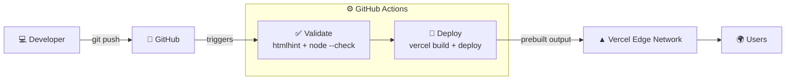

# 🦖 Dino Run

A browser endless runner inspired by Chrome's offline dinosaur game. It's plain HTML, CSS and JavaScript with no build step and no dependencies. It deploys to Vercel through a GitHub Actions CI/CD pipeline.

- Jump over cacti and duck under birds
- The game speeds up the longer you survive
- Your high score is saved in the browser
- Retro sound effects
- Supports dark mode, keyboard and touch
- The footer shows the exact commit and pipeline run behind the live page

## Controls

| Action | Keys |
|---|---|
| Jump / start / restart | <kbd>Space</kbd>, <kbd>↑</kbd>, <kbd>W</kbd>, or tap |
| Duck (fast-fall in mid-air) | <kbd>↓</kbd>, <kbd>S</kbd> |

## Project structure

```
.
├── .github/workflows/deploy.yml   # CI/CD pipeline
├── public/                        # everything Vercel serves
│   ├── index.html
│   ├── style.css                  # theme tokens (colors)
│   └── game.js                    # game logic; tune gameplay in CONFIG
├── vercel.json                    # static hosting config
└── README.md
```

## Run locally

```bash
npx serve public
# or
python3 -m http.server 8000 -d public
```

When running locally, the footer says **"Running locally"**. Build info is only filled in by the pipeline.

## Customize

Edit `CONFIG` at the top of `public/game.js` to change the gameplay:

```js
const CONFIG = {
  startSpeed: 6,
  maxSpeed: 13,
  acceleration: 0.0015,
  gravity: 0.65,
  jumpVelocity: 12,
  birdsAfterScore: 250,
  ...
};
```

Colors live as CSS variables in `public/style.css`. The game reads `--ink`, `--game-bg` and `--cloud` directly.

## CI/CD pipeline



| Trigger | Result |
|---|---|
| Push to `main` | validate → **production** deploy |
| Pull request to `main` | validate → **preview** deploy (unique URL) |
| Manual (`workflow_dispatch`) | validate → production deploy |

**`validate`** lints the HTML with `htmlhint` and checks the JavaScript syntax with `node --check`. If either check fails, nothing is deployed.

**`deploy`** does the following:
- Writes the commit SHA, build time, repo name and run URL into `index.html`
- Runs `vercel pull`, then `vercel build`, then `vercel deploy --prebuilt`
- Publishes the URL to the job summary and the GitHub environment

A `concurrency` group cancels older runs on the same branch, so only the newest push deploys.

`vercel.json` sets `git.deploymentEnabled: false`, so GitHub Actions is the only thing that deploys. You never get duplicate deployments, and the validation step can't be bypassed.

## Deployment setup

1. **Link a Vercel project**

   ```bash
   npm install --global vercel
   vercel login
   vercel link
   cat .vercel/project.json   # → { "orgId": "...", "projectId": "..." }
   ```

2. **Create a token.** Go to Vercel → Account Settings → Tokens → Create Token.

3. **Add repository secrets.** In GitHub, go to Settings → Secrets and variables → Actions and add these:

   | Secret | Value |
   |---|---|
   | `VERCEL_TOKEN` | token from step 2 |
   | `VERCEL_ORG_ID` | `orgId` from `.vercel/project.json` |
   | `VERCEL_PROJECT_ID` | `projectId` from `.vercel/project.json` |

4. **Deploy.** Push to `main`, or go to Actions → *CI/CD — Deploy to Vercel* → Run workflow.

## Troubleshooting

| Symptom | Fix |
|---|---|
| `No existing credentials found` | The `VERCEL_TOKEN` secret is missing or misspelled. |
| `Project not found` | `VERCEL_ORG_ID` or `VERCEL_PROJECT_ID` is wrong. Re-run `vercel link`. |
| Two deployments per push | Keep `git.deploymentEnabled: false` in `vercel.json`. |
| Fork PRs don't deploy | Expected: GitHub doesn't expose secrets to fork PRs. |
